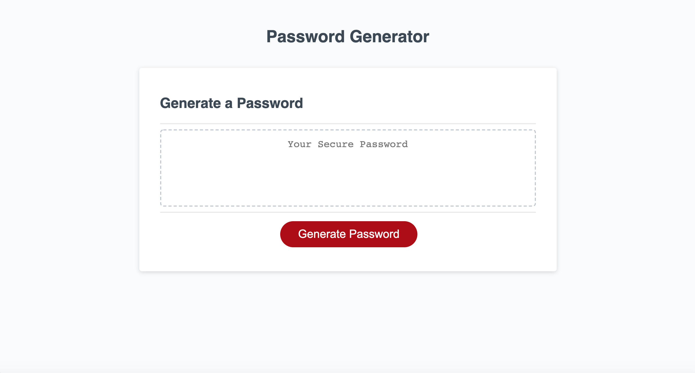

# Random Password Generator
## This Repository
This repository is used to prompt a user with a random password. We were given a starter code that already contained the css styles and html structure, however, we were asked to solve the issue on how a user can answer a few prompts to get a random password in return.

Below, you will see a screenshot of the password generator website. 

 

## The Functions
When the user clicks the "Generate Password" button, they will then be given various prompts about the password criteria:

* Setting a length for the password.

* Deciding if they would like to use lowercase caracters.

* Deciding if they would like to use uppercase characters.

* If they would like to use numeric characters.

* And if they would like to use special characters.

Once the prompts are answered, then the user will see a random password generated inside of the box that states "Your Secure Password". 